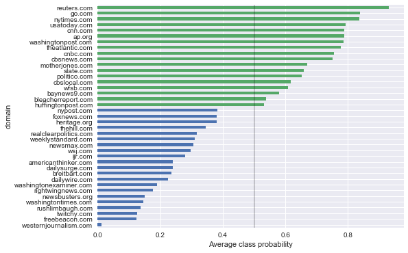

# Predicting Political Bias in the News with a Recurrent Neural Network

__Under Construction :)__

## Intro

Neural networks have proven to be very good at natural language processing tasks ranging from identifying document sentiment to language translation to text summarization. As an avid consumer of news articles, where the personal, political and cultural biases of the publisher has become increasingly prevalent in recent months, I found myself asking:  "Can a neural network identify political bias?"  As it turns out, the answer is a qualified "yes", and this post will describe how.

The short version of the story is this.  I collected and labeled around 75k news articles using a script that ran in AWS for about 4 months.  I then fed this data into a recurrent neural network (RNN) and trained the model to predict the probability of a given article being labeled "conservative" or "liberal".  The results aren't bad, considerably better than any naive guessing strategy.  Furthermore, the models predictions are remarkably good at domain-level classification, meaning on average a publication like the NYTimes is ranked at the liberal end of the spectrum while the Washingon Times is predicted to be highly conservative.  What's particularly interesting about using an RNN for this task is that predictive scores can be attributed to specific points in the text, given us a mechanism to highlight specific words and phrases that model views as correlated with a specific point of view.

For those less interested in technical details, feel free to skip to the [discussion](#Discussion) :)

## Building a Dataset

The data set for this project was designed to help answer the following question:

> On a scale from 0 (conservative) to 1 (liberal), how politically biased is a given news article?

(Don't attribute any additional meaning to those scores . . . they're just numerical labels! :)  This is a supervised learning problem, ii.e., our training data are labeled, and the dataset needed to be generated accordingly.  

Getting enough labeled data is often one of the biggest challenges in any machine learning application, and this problem was no different.  Ultimately, I couldn't find a data set that had the information I wanted so I did what any hacker would do, and created it myself!  Here's what I came up with:

1. Search the web and identify domains that are widely considered "liberal" or "conservative".
1. For each of these domains, hand curate a [list of RSS feeds](https://github.com/davebiagioni/news-crawler/tree/master/rss).
1. Periodically (a few times a day) check for updates to the RSS feeds and retrieve any new stories, labeling them based on the source domain. I used a simple SQL database to make sure I didn't retrieve any URL's twice.
1. Let the job run for a few months in AWS, on  free node :)

If you're curious about the specifics of the pipeline, check out [this Git repo](https://github.com/davebiagioni/news-crawler).  Suffice it to say, after letting the job run continuously from December 2016 through April 2017, I was able to pull down ~75k labeled news articles of which over 40k are specifically about U.S. politics.  Ideally, this number would be in the 100k+ range, but this is the best I could do given my time and budget :)  And, it turns out, it's enough to do something cool with!

I tried to make the crawl class-balanced, and got pretty close.  The final data set has 107 different domains, 30 of which have over 100 samples.  You can view domain counts and relative frequency in [this table](domains.md).

## Preprocessing

(Details in [this notebook](../news-classifier/1-preproc.ipynb)).

A fair bit of pre-processing was needed to get the data into a shape where an RNN could ingest it.  The steps were:

- __Lemmatizing__ or reducing words to their stems.  This makes it so that words like "run" and "ran" or "person" and "people" are seen as the same by the model, reducing the space of words the model needs to understand and thereby its complexity and training time.
- __Part of speech tagging__.  This helps the model disambiguate words that have the same surface forms like, e.g., "duck" or "can", which can be both nouns and verbs depending on context.
- __Truncating input sequences__.  This makes the model easier to train, and is also somewhat justifiable for news articles since the crux of the story often appears in the first paragraph or two.  The best model truncated at 200 tokens.
- __Limiting the vocabulary size__ by throwing away all but the top `n` words.  In addition to speeding up training, this is justifiable from the point of view that political bias will often appear in the context of discussing popular topics such as the U.S. Presidency, where those words will be common across articles.  The best model used a vocabulary of size 10k.

## Building and Training a Model

(Details in [this notebook](../news-classifier/2-classify.ipynb)).

In the spirit of keeping it simple, I opted to use the Keras package in Python which has a nice, high-level interface to various backends.  After experimenting with a bunch of different architectures of varying complexity, but found that a small, vanilla Gated Recurrent Unit (GRU) worked quite well and was relatively fast to train.  The entire architecture consists of an embedding layer connected to a GRU whose output is then passed through a shallow, fully-connected layer that makes the prediction.  The model was trained on a home desktop equipped with an NVIDIA GeForce 1080 GPU, using the Tensorflow GPU Docker image as the Keras backend.

## Discussion

### Model performance

Since I generated this data set from scratch, I didn't have much to compare model accuracy to.  What I could do, however, was compare it to a "biased guesser" model which uses a knowledge of the number of examples per class to make the most probable prediction.  We'll call this the "benchmark" method.  If asked to predict a probability that an article is liberal, the benchmark model would always guess 57% since this percentage of all articles are liberal.  For the same reason, if asked to predict a specific class labels it would always predict "liberal" (for the same reason).  Here's how the RNN did against the benchmark:

| Metric        | RNN           |  Benchmark  |
| ------------- |-------------| ----- |
| Accuracy (%) | __81.6__ | 55.7 |
| F1 Score | __0.84__ | 0.72 |
| Log Loss | __0.41__ | 0.68 | 

These metrics are on a held-out test set that the model never saw . . . Not too shabby, and a heck of a lot better than random!

### Domain-level classification

I wanted to dig a little deeper into what the model was actually finding.  An obvious question was: "given all of the articles in the dataset, how are the predictions distributed?"

We see that the model is really confident about some of the examples, typically conservative ones, but is more nuanced for others.  And actually, this is kind of what we expect and want since not all articles are highly polarized in one direction or the other.

Another interesting question was:  "given all of the scores for a given domain, how often is the average score correct in terms of the domain attribution?"  In other words:  on the scale of 0 to 1, where does the average NY Times article fall compared with, say, Breibart News?  The bar chart below shows exactly this:

Here green a bar indicates "liberal" label and blue indicates "conservative", and the black vertical line shows the prediction cutoff of 0.5.  If we round the average score to 0/1, we find that the model correctly classifies __100%__ of the top 30 domains (if we include under sampled domains, it's closer to 75%).  Not bad! This point of view gives an interesting way to rank the entire domain on the political spectrum. 

### Examples

### Word embeddings